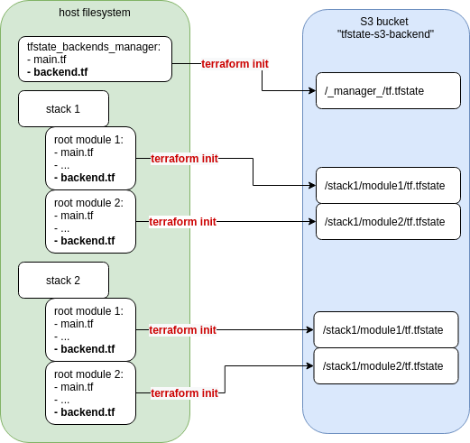

This example demonstrates a basic usage of this module. 

On your system, 

- you have a root module tfstate-s3-manager which 
includes terraform-aws-multi-stack-backends
- you have (in this example) 4 root modules, each in their own folder
- two of those root modules belong to one stack, the other two belong
  to the other stack
- the `tfstate-s3-manager/main.tf` defines the stacks to manage: 
  ```hcl
  stacks_map = {
    stack-1 = {
      network = {
        path = "../stack1-network"
      }
      cluster = {
        path = "../stack1-cluster"
      }
    },
    stack-2 = {
      network = {
        path = "../stack2-network"
      }
      cluster = {
        path = "../stack2-cluster"
      }
    },
  }
  ```
- the names are arbitrary (stack-1, network, etc)

See the left green box in following diagram: 


### Step 1

Assume you have already run `terraform apply` in each root 
module of each stack. The order does not matter. This step 
can be done after step 2 as well. 

Then `terraform apply` in the `tfstate-s3-manager` root module, 
which will create the common bucket, its replica, dynamodb 
lock table, IAM policy etc, *as well as all the backend.tf*
files (one for each root module of each stack, specified 
in the `main.tf`). See the following diagram. 


### Step 2

Then you should (although this is optional) move the 
`tfstate-s3-manager` tfstate to s3, by running `terraform init`
for that root module. This can be done before or after step 3.


### Step 3

Finally you can go to each stack's root module's and `terraform
init`. This will move each stack's root module's tfstate from
local host to s3, using the `backend.tf` generated by the 
`tfstate-s3-manager`. See the following diagram. 



### Subsequently

From then on, whenever you `terraform apply` in one of the 
root modules associated with a stack, the *whole stack* will 
get locked. See the following diagram. 


To delete a root module from a stack, if the stack has other 
root modules in main.tf

- `terraform destroy` for the root module you no longer need
- edit the `tfstate-s3-manager/main.tf` by removing the entry; 
  ATTENTION: if there are no modules left for that stack in main.tf,
  *leave the stack's empty map* so that the dynamodb table does not
  get destroyed yet, eg
  ```hcl
  stacks_map = {
    stack-3 = {}, // no longer needed
  }
  ```
- depending on your situation:
  
  - just delete the module folder, OR 
  - `terraform apply` to remove the corresponding `backend.tf` then
    `terraform init`

Once a stack's module have all been removed, you can delete the empty
stack map from stacks_map, and `terraform apply` to remove the dynamodb
table for that stack. 